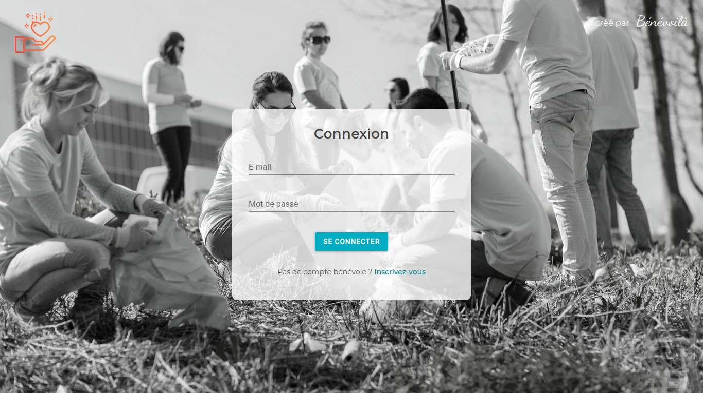
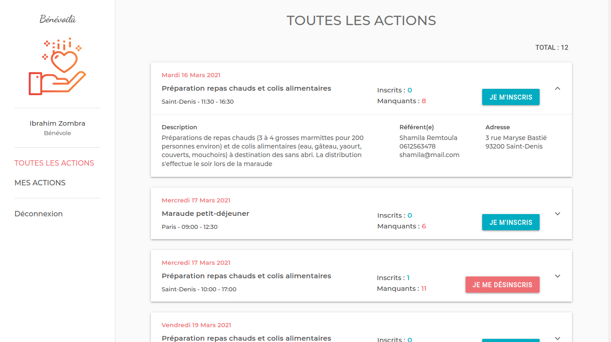
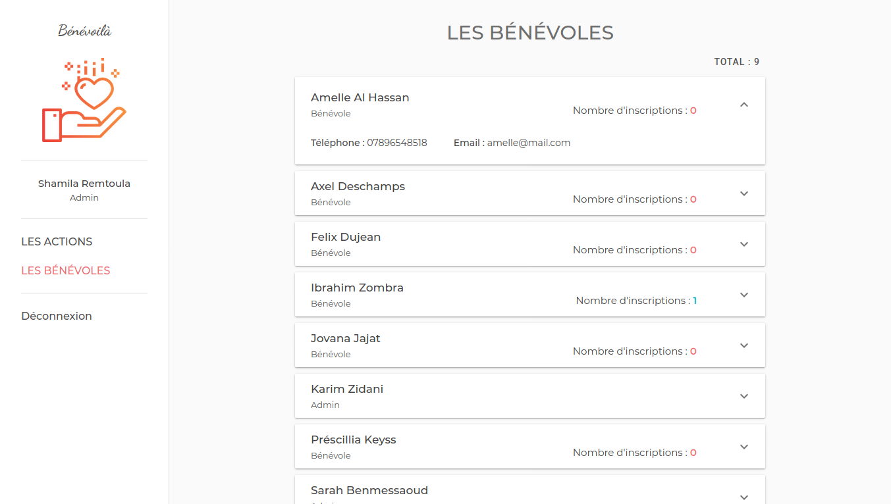

# Bénévoilà

## Description du projet
_Ce projet a été réalisé dans le cadre du passage du titre professionnel de niveau III Développeur web et web mobile à Simplon._

Il s'agit d'une application web qui permet à une association de gérer ses actions de bénévolat et qui simplifie l'inscription de ses bénévoles aux différentes actions.

__L'association__ peut ainsi ajouter et modifier des actions de bénévolat, en définissant le nombre minimum de bénévoles dont elle a besoin, et voir en temps réel combien de bénévoles sont inscrits à leurs actions et combien sont manquants.

__Les bénévoles__, quant à eux, peuvent consulter les différentes actions que proposent leur association et s'inscrire à celles qu'ils souhaitent après avoir créé un compte. Ils peuvent alors voir les actions auxquelles ils sont inscrits et celles auxquelles ils ont participé, se désinscrire à tout moment et contacter les référents pour toute question.

### Technos utilisées

- __React JS__  
    * Librairie de composants : __Material-UI__ _(https://material-ui.com/)_  
 
 __À utiliser avec l'API [Bénévoila API](https://github.com/ShamShams/Benevoila-api)__

  
  
  
